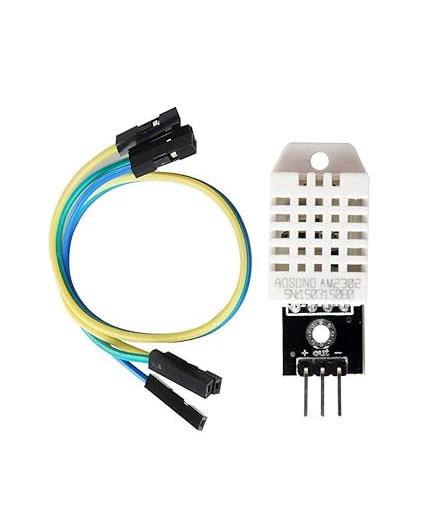

# Writing an Embedded Rust Driver for the DHT22

The DHT22, also known as AM2302, is a digital sensor used for measuring both temperature and humidity. If you're building a device that needs to detect environmental conditions like room temperature or humidity levels, this sensor is a great choice. You can easily purchase it online from stores at an affordable price. The older version is DHT11 which is slighly less accurate than DHT22.

The DHT22 uses a capacitive humidity sensor and a thermistor to measure the surrounding air. It then sends this data as a digital signal over a single data line, so you do not need any analog input pins.

Here are some key features of the DHT22:

- Measures humidity from 0 to 100 percent RH with 2 to 5 percent accuracy
- Measures temperature from -40 to +80 degrees Celsius with around ±0.5 degree accuracy
- Communicates over a single-wire digital protocol

In this chapter, we will learn how to write a driver for this sensor. I chose the DHT22 because it uses a simple communication method, making it suitable for learning how to write embedded Rust drivers. It is also low-cost and widely available.

Another benefit is that the DHT22 is supported by the Wokwi simulator. That means once we write the driver, we can test it in a virtual environment without needing real hardware.  But I still recommend running it on real hardware if you can - just to get the actual feel of working with a physical device.

### DHT22 Sensor and Module
The DHT22 is available in two forms: the bare sensor and a ready-to-use module. The bare sensor comes in a 4-pin package, but only three of those pins are needed. The module version is typically provided with just three pins, which are the ones actually needed for operation.

One key difference is that the module includes an onboard pull-up resistor and a filtering capacitor. These help with signal stability and clean communication. The bare sensor does not include these components, so you will need to add them externally if you use the raw 4-pin sensor in your own circuit.

1. **VCC** - Connects to 3.3V or 5V
2. **Data** - Signal pin connected to a GPIO (pull-up resistor is already present on the board)
3. **GND** - Ground

