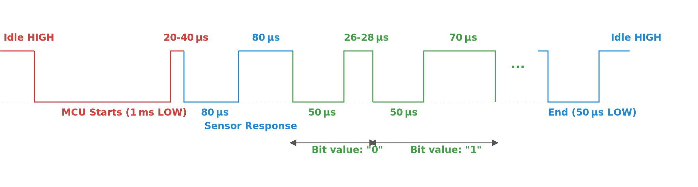

# DHT22 with 1-Wire protocol

The DHT22 communicates with the microcontroller using a custom single-wire protocol. It uses only one data line for transferring data. The microcontroller must follow strict timing rules to read the temperature and humidity data correctly from the sensor.

So, where do we get these details? From the datasheet. If you are moving beyond basic examples in embedded programming, learning how to read datasheets is an important skill. 

To be honest, the first time I looked at a microcontroller datasheet, it felt scary. Even now, I still find them a bit overwhelming - just slightly less than before. But once you start using them regularly, it gets easier. The good thing is that sensor datasheets are usually much simpler compared to full MCU datasheets.

You can find the DHT22 datasheet [here](https://cdn.sparkfun.com/assets/f/7/d/9/c/DHT22.pdf). It describes how the communication between the DHT22 sensor and the microcontroller works. But I have to admit, the explanation is a bit cryptic and not very beginner-friendly. So, I will try to break it down step by step and explain the communication process in a simpler way.

## Communication Overview
Here's a high-level view of the communication between the MCU and the DHT22:

```text
+-----------+           +--------+
|   MCU     |           | DHT22  |
+-----------+           +--------+
      |                      |
      |--- Start Request --->|
      |                      |
      |<---- Response -------|
      |                      |
      |<-- 40-bit Data ------|
      |                      |
      |<-- End Signal -------|
      |                      |
      |   Idle / Processing  |
      |                      |
```

The diagram above shows the high-level flow of communication between the microcontroller (MCU) and the DHT22 sensor. The process begins with the MCU sending a start request by pulling the data line low for a specified duration. This signals the DHT22 to begin its response. The sensor then replies with a short response signal, indicating it is ready to transmit data. 

Following that, the DHT22 sends 40 bits of data which include humidity, temperature, and a checksum for validation. Once all bits are transmitted, the sensor sends an end signal and then releases the line. The communication ends with the bus returning to an idle high state.

## Communication Sequence

The diagram below shows how the MCU and the DHT22 sensor talk to each other using just one data wire. This communication follows a specific pattern. If the timing is wrong, the data might not be received correctly.



1. Idle State  
   The data line is initially in an idle HIGH state, held high by a pull-up resistor.

2. Start Signal (MCU to DHT22)  
   The microcontroller begins communication by pulling the line LOW for at least 1 ms. This tells the DHT22 to prepare for data exchange.

3. MCU Release (20-40 us HIGH)  
   After the LOW signal, the MCU releases the line. It goes HIGH for 20 to 40 microseconds, indicating that the MCU is ready to receive a response.

4. Sensor Response (DHT22 to MCU)  
   The DHT22 responds by pulling the line LOW for 80 us, then HIGH for 80 us. This signals the beginning of the sensor's data transmission.

5. Data Transmission - 40 Bits  
    The sensor sends a total of 40 bits of data, which are divided into three parts: 16 bits represent the humidity value, 16 bits represent the temperature value, and the remaining 8 bits are used as a checksum to verify data integrity.

   Each bit starts with a 50 us LOW pulse. After that:
   - If the line is HIGH for ~26-28 us, the bit is a 0
   - If the line is HIGH for ~70 us, the bit is a 1

6. End of Transmission  
   After sending all 40 bits, the DHT22 pulls the line LOW for about 50 us, then releases it. The line goes HIGH and remains idle.
