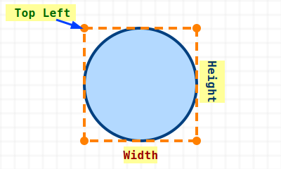

# Dimensions

Let's begin with the [Dimensions](https://docs.rs/embedded-graphics-core/latest/embedded_graphics_core/geometry/trait.Dimensions.html) trait. This trait is used by display drivers and drawable objects in embedded-graphics to describe the area they cover.

The Dimensions trait requires implementing one method called bounding_box. This method returns a Rectangle that defines the smallest rectangle fully enclosing the object or display.

### What is Bounding box?

A bounding box is the smallest rectangle that completely contains the pixels of the object or display area you want to work with.

It is defined by two things:

- The top-left corner position (an x and y coordinate), which marks where the rectangle starts on the display, and

- The size (width and height), which tells how wide and tall the rectangle is.

You can think of it as drawing a frame around an object. Everything inside the frame belongs to the object, and everything outside is ignored.

The embedded-graphics requires this information so it can perform operations such as layout, collision detection, and transformations.



All primitive shapes in embedded-graphics (such as Rectangle, Circle, Triangle, and others) implement the Dimensions trait, which provides a bounding_box method.

For example, here is how Circle [implements Dimensions](https://github.com/embedded-graphics/embedded-graphics/blob/e3d8897c5a7e0503be929c782d9df2bd4f4c6e30/src/primitives/circle/mod.rs#L138):
```rust
impl Dimensions for Circle {
    fn bounding_box(&self) -> Rectangle {
        Rectangle::new(self.top_left, Size::new_equal(self.diameter))
    }
}
```

Normally, you create a Circle like this:

```rust
Circle::new(TOP_LEFT_POSITION, DIAMETER);
```

Using this information, the bounding_box method creates a Rectangle that fully contains the circle. With the bounding box, embedded-graphics can determine the shape's size and position, which allows it to handle tasks like collision checks, layout calculations, and deciding what part of the display needs to be redrawn.

## Dimensions for Display

We are not going to implement the Dimensions trait directly. Instead, we will implement the OriginDimensions trait for the LedMatrix.

The reason is that embedded-graphics already provides a [blanket implementation](https://github.com/embedded-graphics/embedded-graphics/blob/e3d8897c5a7e0503be929c782d9df2bd4f4c6e30/core/src/geometry/mod.rs#L85C1-L92C2) of Dimensions for every type that implements OriginDimensions:

```rust
impl<T> Dimensions for T
where
    T: OriginDimensions,
{
    fn bounding_box(&self) -> Rectangle {
        Rectangle::new(Point::zero(), self.size())
    }
}
```

> 🦀 In Rust, a blanket implementation is a way to automatically implement a trait for all types that meet certain conditions (like already implementing another trait), without writing separate code for each type. 
>
>For example, For example, the standard library has an implementation written as `impl<T: Display> ToString for T`. This means that every type that implements the Display trait gets acces to to_string() method. Because of this, String, i32, and any custom type that implements Display trait can call to_string() on it.
> 
> In our case, any type that implements OriginDimensions automatically gets an implementation of Dimensions.

As you can see, embedded-graphics implements Dimensions for all types that implement OriginDimensions. The top_left point is always (x=0, y=0) because we are describing the whole display (like the LED matrix), which naturally starts at position (0, 0).

What remains is to define the size of our display. So for our LedMatrix, all we need to do is implement OriginDimensions and provide the size() method. The blanket implementation then ensures LedMatrix also implements Dimensions, with the bounding box starting at (0, 0) and using the size we specify.

## Implementing for our LedMatrix

We will implement the OriginDimensions trait for our LedMatrix struct. This trait requires only one method `size()` which returns the size of the display area.

Since our LED matrix consists of multiple 8x8 devices daisy-chained horizontally, the width is DEVICE_COUNT * 8 pixels, and the height is always 8 pixels.

Update the disply.rs module with the following code.

Import the trait:

```rust
use embedded_graphics_core::prelude::{OriginDimensions};
```

Here's the implementation :

```rust
impl<SPI, const BUFFER_LENGTH: usize, const DEVICE_COUNT: usize> OriginDimensions
    for LedMatrix<SPI, BUFFER_LENGTH, DEVICE_COUNT>
{
    fn size(&self) -> Size {
        Size::new(DEVICE_COUNT as u32 * 8, 8)
    }
}
```

## Tests

```rust
#[cfg(test)]
mod tests {
    use super::*;
    use crate::registers::Register;

    use embedded_graphics_core::{prelude::Point, primitives::Rectangle};
    use embedded_hal_mock::eh1::spi::Transaction;

    // ... Previous tests

    #[test]
    fn test_bounding_box() {
        const OUR_DEVICE_COUNT: usize = 2;
        const BUFFER_LENGTH_FOR_OUR_DEVICE: usize = 64 * OUR_DEVICE_COUNT;

        let mut spi = SpiMock::new(&[]);
        let driver = Max7219::new(&mut spi)
            .with_device_count(OUR_DEVICE_COUNT)
            .expect("2 is valid device count");

        let matrix: LedMatrix<_, BUFFER_LENGTH_FOR_OUR_DEVICE, OUR_DEVICE_COUNT> =
            LedMatrix::from_driver(driver).expect("driver is properly intialized");

        assert_eq!(
            matrix.bounding_box(),
            Rectangle::new(Point::new(0, 0), Size::new(16, 8))
        );

        spi.done();
    }
}
```
