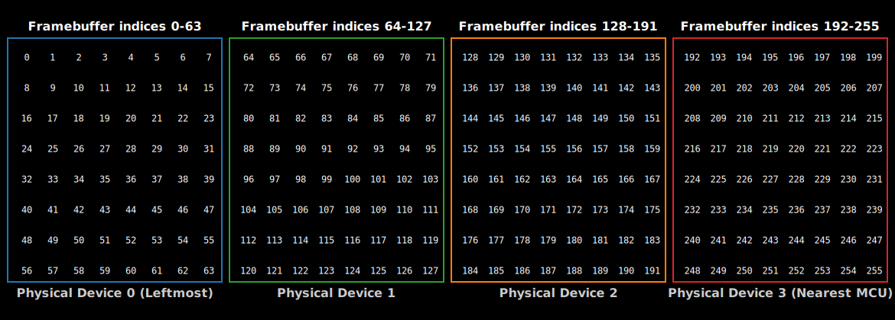

# Implementing Draw Target for Max7219 LedMatrix

Next, we will implement the DrawTarget trait for our LedMatrix struct. This trait lets us draw pixels and shapes onto the LED matrix using embedded-graphics APIs.

Required imports:

```rust
use embedded_graphics_core::geometry::Dimensions;
use embedded_graphics_core::pixelcolor::BinaryColor;
use embedded_graphics_core::prelude::{DrawTarget, OriginDimensions, Size};
```

Here is the full implementation of the DrawTarget trait for our LedMatrix (add this in the display.rs module). We have implemented the draw_iter function that takes an iterator of pixels to draw. 

We set the Color type to BinaryColor because the LED matrix supports only on and off states. We then set the Error type to core::convert::Infallible since all drawing operations modify only the local framebuffer. No hardware communication happens during drawing, so there is no possibility of errors at this stage. This means our drawing operations are infallible and guaranteed to succeed.

```rust

impl<SPI, const BUFFER_LENGTH: usize, const DEVICE_COUNT: usize> DrawTarget
    for LedMatrix<SPI, BUFFER_LENGTH, DEVICE_COUNT>
where
    SPI: SpiDevice,
{
    type Color = BinaryColor;
    type Error = core::convert::Infallible;

    fn draw_iter<I>(&mut self, pixels: I) -> core::result::Result<(), Self::Error>
    where
        I: IntoIterator<Item = Pixel<Self::Color>>,
    {
        let bb = self.bounding_box();
        for Pixel(pos, color) in pixels.into_iter() {
            if bb.contains(pos) {
                let device_index = (pos.x as usize) / 8;
                let col = (pos.x as usize) % 8;
                let row = pos.y as usize;

                if device_index < DEVICE_COUNT && row < 8 && col < 8 {
                    let index = device_index * 64 + row * 8 + col;
                    if index < self.framebuffer.len() {
                        self.framebuffer[index] = color.is_on() as u8;
                    }
                }
            }
        }

        // Note: Does not call self.flush() automatically.
        Ok(())
    }
}
```

## How it looks in Display?

Before i explain the code, let me quickly show you how the embedded-graphics coordinates map to the physical LED matrix layout.

From the embedded-graphics point of view, all the daisy-chained devices together form one big display. The pixel at coordinate (0, 0) corresponds to the first LED on the leftmost device in the chain.

<div style="text-align: center;">
  <a href="./images/max7219-deviecs-embedded-graphics-co-ordinates.png"></a>
  <figcaption style="font-style: italic; margin-top: 8px; color: #555;">
    Figure 1: 4 daisy-chained Max7219 devices and Embedded Graphics co-ordinates.
  </figcaption>
</div> 

In the case of 4 daisy-chained devices, each device is 8 pixels wide, so the total width is 4 × 8 = 32 pixels. The pixel at coordinate (24, 0) corresponds to the first LED on the rightmost device, which is the one closest to the microcontroller.

So, the coordinates start at the left and increase to the right, from the leftmost device to the rightmost device.

## Device and Position Calculation

First, we get the bounding box of the display to know the valid drawing area. Then, for each pixel provided by the iterator, we check if the pixel's position lies inside this bounding box.

```rust
//  Code snippet
if bb.contains(pos) {
    let device_index = (pos.x as usize) / 8;
    let col = (pos.x as usize) % 8;
    let row = pos.y as usize;
    
    // rest of the code...
}
```

Next, we find out which device the pixel belongs to by dividing its x-coordinate by 8. Each device is one 8-pixel-wide LED matrix device connected in a chain.

The column within that device is the remainder when dividing the x-coordinate by 8, and the row is simply the y-coordinate.

For example, if the pixel position is (5, 2), dividing 5 by 8 gives 0, so the pixel belongs to device 0. The remainder of this division (5 % 8) is 5, which gives the column position within that device. The row position directly maps to the y value, which is 2.

## Updating Pixel State in the Framebuffer

Next, we verify that the calculated device number, row, and column are within valid ranges: the device must be less than the total number of devices, and the row and column must be less than 8 because each device is an 8x8 matrix. 

I have created this image to illustrate the framebuffer layout for four daisy-chained devices, making it easier to understand how the indexing works.

<div style="text-align: center;">
  <a href="./images/framebuffer-max7219-deviec-indices.svg"></a>
  <figcaption style="font-style: italic; margin-top: 8px; color: #555;">
    Figure 1: 4 daisy-chained Max7219 devices with corresponding framebuffer indices.
  </figcaption>
</div> 


After confirming the indices are valid, we calculate the linear index into the framebuffer. The framebuffer is stored as a flat array, with each device using 64 bytes (8 rows × 8 columns). The first 64 entries belong to the first device, the next 64 entries belong to the second device, and so on. To compute the index, we multiply the device number by 64, add the row offset (row × 8), and then add the column offset.

```rust
// Code snippet
let index = device * 64 + row * 8 + col;
if index < self.framebuffer.len() {
    self.framebuffer[index] = color.is_on() as u8;
}
```

Finally, if the index is within the framebuffer length, we set the framebuffer byte at that index to 1 if the pixel color is on, or 0 if it is off. This updates the local framebuffer to reflect the pixel changes requested by the draw operation.

If we apply this to the example pixel position (5, 2), where device = 0, row = 2, and col = 5, the index is calculated as:

```rust
index = 0 * 64 + 2 * 8 + 5 = 21
```

This means we update the 21st byte in the framebuffer array to turn the pixel on or off, depending on the color.is_on() value.


## Tests

```rust
#[cfg(test)]
mod tests {
    use super::*;
    use crate::registers::Register;

    use embedded_graphics_core::{prelude::Point, primitives::Rectangle};
    use embedded_hal_mock::eh1::spi::Mock as SpiMock;
    use embedded_hal_mock::eh1::spi::Transaction;

    // ... Previous tests
    
    #[test]
    fn test_draw_target_draw_iter() {
        let mut spi = SpiMock::new(&[]);
        let driver = Max7219::new(&mut spi);
        let mut matrix: LedMatrix<_> = LedMatrix::from_driver(driver).unwrap(); // 1 device, 64 pixels

        // Define some pixels to draw
        let pixels = [
            Pixel(Point::new(0, 0), BinaryColor::On), // Device 0, Row 0, Col 0
            Pixel(Point::new(1, 0), BinaryColor::Off), // Device 0, Row 0, Col 1
            Pixel(Point::new(7, 7), BinaryColor::On), // Device 0, Row 7, Col 7
            // out of bounds
            Pixel(Point::new(8, 0), BinaryColor::On),
            Pixel(Point::new(0, 8), BinaryColor::On),
            Pixel(Point::new(20, 20), BinaryColor::On),
        ];

        // Draw the pixels
        matrix.draw_iter(pixels.iter().cloned()).unwrap();

        let mut expected = [0u8; 64];
        expected[0] = 1; // (0, 0) ON
        expected[1] = 0; // (1, 0) OFF
        expected[63] = 1; // (7, 7) ON

        assert_eq!(&matrix.framebuffer, &expected);

        spi.done();
    }

    #[test]
    fn test_draw_target_draw_iter_multi_device() {
        let mut spi = SpiMock::new(&[]);
        let driver = Max7219::new(&mut spi).with_device_count(2).unwrap(); // 2 devices
        let mut matrix: LedMatrix<_, 128, 2> = LedMatrix::from_driver(driver).unwrap(); // 2 devices, 128 pixels

        // Define some pixels to draw across devices
        let pixels = [
            // x=0 -> device = 0/8 = 0
            // col = 0%8 = 0
            // row = 0
            // index = device*64 + row*8 + col = 0*64 + 0*8 + 0 = 0
            Pixel(Point::new(0, 0), BinaryColor::On),
            // x=7 -> device = 7/8 = 0
            // col = 7%8 = 7
            // row = 0
            // index = 0*64 + 0*8 + 7 = 7
            Pixel(Point::new(7, 0), BinaryColor::On),
            // x=8 -> device = 8/8 = 1
            // col = 8%8 = 0
            // row = 1
            // index = device*64 + row*8 + col = 1*64 + 1*8 + 0 = 64 + 8 + 0 = 72
            Pixel(Point::new(8, 1), BinaryColor::On),
            // x=15 -> device = 15/8 = 1
            // col = 15%8 = 7
            // row = 7
            // index = 1*64 + 7*8 + 7 = 64 + 56 + 7 = 127
            Pixel(Point::new(15, 7), BinaryColor::On),
        ];

        // Draw the pixels
        matrix.draw_iter(pixels.iter().cloned()).unwrap();

        // Check framebuffer state
        let mut expected = [0u8; 128];
        expected[0] = 1; // Device 0, Col 0, Row 0
        expected[7] = 1; // Device 0, Col 7, Row 0
        expected[72] = 1; // Device 1, Col 0, Row 1
        expected[127] = 1; // Device 1, Col 7, Row 7

        assert_eq!(&matrix.framebuffer, &expected);

        spi.done();
    }

}
```
