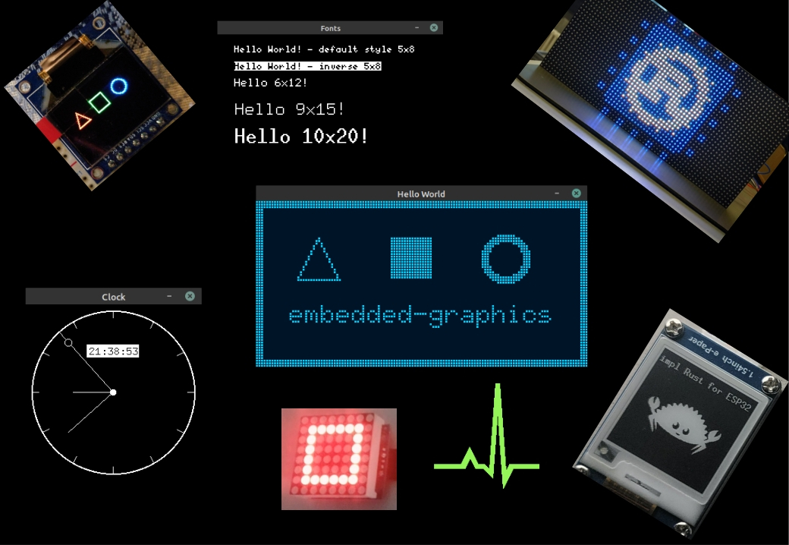

# Implementing Embedded Graphics for Max7219 Rust Driver

In this chapter, we are not going to create a new driver from scratch. Instead, we will build on top of the Max7219 driver we already wrote. I think the Max7219 and the LED Matrix are a perfect choice to introduce you to the embedded-graphics crate. You can extend the Max7219 driver (similar to the max7219-display crate) we created in the previous chapter, or you can write this as a separate project that uses the Max7219 driver. The choice is yours.

## Introduction to embedded-graphics

If you have ever played around with displays in embedded projects, you have probably wanted to do more than just turn pixels on and off. You may have already seen the embedded-graphics crate. Creating shapes or using different fonts on different displays is often a tedious process. Even something as simple as drawing a rectangle or a piece of text usually means writing a lot of code and keeping track of each pixel yourself.

This is where the embedded-graphics crate helps.

The [embedded-graphics crate](https://docs.rs/embedded-graphics/latest/embedded_graphics/) is a no-std, pure Rust graphics library designed for embedded environments. It uses a trait-based approach, similar to embedded-hal. A display driver developer (like us) implements the traits provided by embedded-graphics, and once that is done, you get access to many built-in utility features.



The nice part is that it works on many different types of displays. Crates like `ssd1306` for OLED, `ili9341` for TFT, and various e-ink drivers already support it, and the same code you write to draw text on an OLED can also work on a TFT or an e-ink display. You might need small adjustments if the display has different colors or resolutions, but the drawing code stays mostly the same. It is a lot like what embedded-hal does for hardware I/O, but this is for graphics.

Another big advantage is that embedded-graphics does not use a dynamic memory allocator. It uses an iterator-based approach to calculate pixel positions and colors on the fly. This keeps RAM usage low while still giving good performance.

In our case, we will implement embedded-graphics for our Max7219 LED matrix driver. Once we do that, we can draw patterns, shapes, and text using the same high-level commands that work on other displays. Instead of manually setting LEDs one by one, we simply describe what we want to draw and let embedded-graphics handle the rest.

The official embedded-graphics documentation explains the crate in much more detail than I can here. I recommend checking it out [here](https://docs.rs/embedded-graphics/latest/embedded_graphics/).


## Project Setup

I have cloned the max7219-driver-project that we completed in the previous chapter. I will work on the cloned version because I want to keep the original project intact as a reference for the previous chapter.  But you can just work on the same repository you created for the MAX7219 driver.

```sh
git clone https://github.com/ImplFerris/max7219-driver-project max7219-eg
cd max7219-eg
code
```

## Goal

We will create a new module called "led_matrix" and define a submodule "display" inside it. In display, we will define the LedMatrix struct and implement embedded-graphics support for it.

```sh
.
├── Cargo.toml
├── src
│   ├── driver
│   │   ├── max7219.rs
│   │   └── mod.rs
│   ├── error.rs
│   ├── led_matrix
│   │   ├── display.rs
│   │   └── mod.rs
│   ├── lib.rs
│   └── registers.rs
```


## Implementing Embedded Graphics Core

So what do we have to implement in order to be compatible with embedded-graphics?

To add embedded-graphics support to a display driver, we must implement the `DrawTarget` trait from the embedded-graphics-core crate.

> Note: This is not the same as the embedded-graphics crate that application developers normally use when they use the display crates. For driver development, you should use embedded-graphics-core instead.

The docs explain the required methods and types that we should define. You can read them [here](https://docs.rs/embedded-graphics-core/latest/embedded_graphics_core/draw_target/trait.DrawTarget.html). Basically, we have to specify the supported [`Color`](https://docs.rs/embedded-graphics-core/latest/embedded_graphics_core/pixelcolor/trait.PixelColor.html) type, the `Error` type, then implement the `draw_iter` method and the `Dimensions` trait.  All other methods have default implementations that rely on these methods internally.

## Update the Dependency

Add the `embedded-graphics-core` crate to your `Cargo.toml`:

```toml
embedded-graphics-core = { version = "0.4.0" }
```
