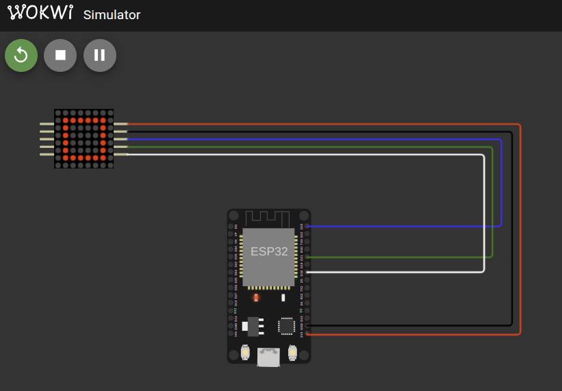

# Using with ESP32

Now that we have successfully implemented the embedded-graphics for our LED Matrix, it is time to put it to the test. I will be showing how to test it on a single LED Matrix (FC-16 module with 1088AS). You can use daisy-chained LED matrices also and try.


## Circuit

Here's a simple circuit connection for wiring the FC-16 MAX7219 LED matrix module to an ESP32.

| FC-16 (MAX7219 Module) Pin | ESP32 Pin     | Notes                |
| -------------------------- | ------------- | -------------------- |
| VCC                        | 3.3V or 5V    | Power supply         |
| GND                        | GND           | Ground               |
| DIN (Data In)              | GPIO23 (MOSI) | SPI Master Out       |
| CLK (Clock)                | GPIO18 (SCK)  | SPI Clock            |
| CS  (Chip Select)          | GPIO21        | SPI Chip Select (CS) |

> ⚠️  Important: If you are using daisy-chained LED matrices, do not power the LED matrix from the microcontroller's 3.3V or 5V pin directly.
>
> Use a separate external 5V power supply to power the LED matrices.
>
> Failing to do so can damage your microcontroller or the LED matrices due to high current draw.
> Always connect the grounds of both power supplies together to have a common reference.


## Add the Crate as a Dependency

Create new project with esp-generate tool and add your Git repository as a dependency in your Cargo.toml:

```toml
embedded-hal-bus = "0.3.0"

# Full Crate
# max7219-display = { git = "https://github.com/ImplFerris/max7219-display", features = [] }

# Bare driver for the Red book:
max7219-eg = { git = "https://github.com/ImplFerris/max7219-eg" }
```

## Full code

In this example, we will use embedded-graphics to draw a square, then a circle inside the square without clearing the display. Then clear the screen and display the character "R".

```rust
#![no_std]
#![no_main]
#![deny(
    clippy::mem_forget,
    reason = "mem::forget is generally not safe to do with esp_hal types, especially those \
    holding buffers for the duration of a data transfer."
)]

use defmt::info;
use embedded_graphics::mono_font::ascii::FONT_5X8;
use embedded_graphics::mono_font::MonoTextStyle;
use embedded_graphics::pixelcolor::BinaryColor;
use embedded_graphics::prelude::*;
use embedded_graphics::prelude::{Point, Primitive, Size};
use embedded_graphics::primitives::{Circle, PrimitiveStyleBuilder, Rectangle};
use embedded_graphics::text::{Text, TextStyleBuilder};
use esp_hal::clock::CpuClock;
use esp_hal::delay::Delay;
use esp_hal::main;
use esp_hal::time::{Duration, Instant};
use esp_println as _;

use embedded_hal_bus::spi::ExclusiveDevice;
use esp_hal::gpio::{Level, Output, OutputConfig};
use esp_hal::spi::master::Config as SpiConfig;
use esp_hal::spi::master::Spi;
use esp_hal::spi::Mode as SpiMode;
use esp_hal::time::Rate;
use max7219_eg::driver::Max7219;
use max7219_eg::led_matrix::LedMatrix;

#[panic_handler]
fn panic(_: &core::panic::PanicInfo) -> ! {
    loop {}
}

esp_bootloader_esp_idf::esp_app_desc!();

#[main]
fn main() -> ! {
    // generator version: 0.4.0

    let config = esp_hal::Config::default().with_cpu_clock(CpuClock::max());
    let peripherals = esp_hal::init(config);

    let spi = Spi::new(
        peripherals.SPI2,
        SpiConfig::default()
            .with_frequency(Rate::from_mhz(10))
            .with_mode(SpiMode::_0),
    )
    .unwrap()
    //CLK
    .with_sck(peripherals.GPIO18)
    //DIN
    .with_mosi(peripherals.GPIO23);
    let cs = Output::new(peripherals.GPIO21, Level::High, OutputConfig::default());

    let spi_dev = ExclusiveDevice::new_no_delay(spi, cs).unwrap();

    let mut driver = Max7219::new(spi_dev);
    driver.init().unwrap();
    let mut display: LedMatrix<_> = LedMatrix::from_driver(driver).expect("valid device count");

    let delay = Delay::new();

    // --- Draw Square ---
    let square = PrimitiveStyleBuilder::new()
        .stroke_color(BinaryColor::On) // Only draw the border
        .stroke_width(1) // Border thickness of 1 pixel
        .build();
    let rect = Rectangle::new(Point::new(1, 1), Size::new(6, 6)).into_styled(square);
    rect.draw(&mut display).unwrap();
    display.flush().unwrap();

    delay.delay_millis(1000);

    // Uncomment to Clear the screen and buffer
    // Without this, it will draw the circle inside the previous square
    // display.clear_screen().unwrap();

    // --- Draw Circle ---
    let hollow_circle_style = PrimitiveStyleBuilder::new()
        .stroke_color(BinaryColor::On)
        .stroke_width(1)
        .build();
    let circle = Circle::new(Point::new(2, 2), 4).into_styled(hollow_circle_style);
    circle.draw(&mut display).unwrap();
    display.flush().unwrap();

    delay.delay_millis(1000);

    // Just clear the buffer. it wont send request to the devices until the flush.
    display.clear_buffer();

    //  Write Text (in single device, just a character)
    let text_style = TextStyleBuilder::new()
        .alignment(embedded_graphics::text::Alignment::Center)
        .baseline(embedded_graphics::text::Baseline::Top)
        .build();
    let character_style = MonoTextStyle::new(&FONT_5X8, BinaryColor::On);
    let text = Text::with_text_style("R", Point::new(4, 0), character_style, text_style);
    text.draw(&mut display).unwrap();
    display.flush().unwrap();

    loop {
        info!("Hello world!");
        let delay_start = Instant::now();
        while delay_start.elapsed() < Duration::from_millis(500) {}
    }

}
```

## Clone Existing Project

If you want to get started quickly, you can clone a ready-to-use example project from my repository:

```sh
git clone https://github.com/implferris/max7219-esp32-eg
cd max7219-esp32-eg
```

This project includes Wokwi configuration, so you can test it with the MAX7219 LED matrix virtually, right inside VSCode using the Wokwi simulator. No physical hardware needed to get started. Just install the Wokwi extension for VSCode and run the project to see the LED matrix in action. For details, visit [https://docs.wokwi.com/vscode/getting-started](https://docs.wokwi.com/vscode/getting-started).




