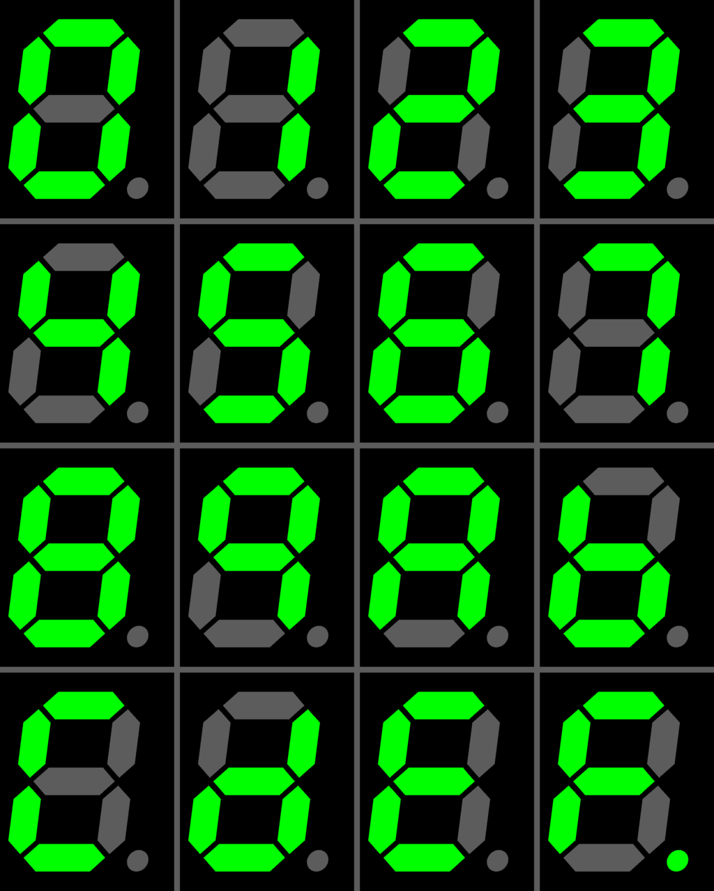
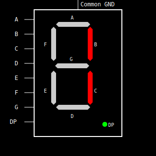
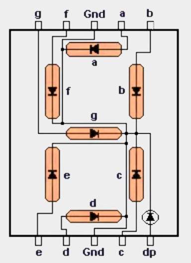
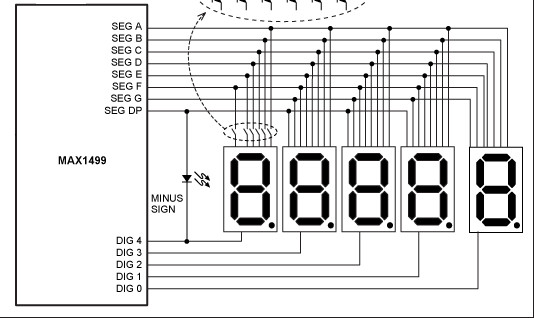

# 7-Segement Displays

The MAX7219 chip was originally designed to control 7-segment displays. A 7-segment display is basically eight tiny LEDs arranged in the shape of the number "8" - seven for the segments (labeled A to G) and one extra for the decimal point (DP). These segments light up in different combinations to show digits and a few letters.

  Image credit: <a href="https://commons.wikimedia.org/wiki/File:Seven_segment_display-gallery.png" target="_blank">Wikimedia</a>

 
MAX7219 works best with the common cathode type. That just means all the negative ends of the LEDs in one digit are tied together and go to ground. The positive ends (anodes) are controlled separately.

To light up a segment, you just turn on the right anode while the common cathode is active. Want to show the number "1" ? Just turn on segments B and C.

Now let's take a closer look at how the wiring actually works. Like we mentioned earlier, each LED's anode is connected to a dedicated pin. But if you follow the line going to GND, you'll see that all the cathodes are tied together. That's why it's called a common cathode display.

## 8 Digit 7-Segment Display

That was simple. But let's have a look at how the 8-digit 7-segment display is connected, how the MAX7219 is wired with it, and how it controls the digits.

Now, each digit has its own set of A to G segments and a decimal point. If we had to control all of them directly, that would mean 8 digits * 8 segments = 64 pins! But the MAX7219 only has 24 pins. So how are we going to control all 8 digits with that? You guessed it - multiplexing.

We already talked about how multiplexing works in the intro. It quickly switches between digits one at a time, fast enough that it looks like all the digits are on at the same time.

Here's how it works: all the segment lines (A to G and DP) are shared across all digits. But each digit has its own separate control line. The MAX7219 activates one digit at a time, sets the segment lines to display the right segments for that digit, then moves to the next digit and repeats the process.

So even though only one digit is ON at any given moment, it switches so quickly that our eyes can't tell; it looks like all digits are lit up together.

## 8-Digit 7-Segment Display Wiring

> NOTE: This is wiring of the MAX1499 chip and a 5-digit 7-segment display. This is not the MAX7219, and not an 8-digit display. This diagram is only meant to illustrate the general wiring method. If I have more time, I will create a proper diagram for the MAX7219 and 8-digit display. 

  Image credit: <a href="https://www.analog.com/en/resources/technical-articles/upgrade-panelmeter-range-and-precision.html" target="_blank">Analog.com</a>

 
As you can see, all the digits share the same segment lines, labeled SEG A to SEG G and SEG DP (Decimal Point). These control which segments light up to form numbers and symbols.

Each digit is activated by its corresponding DIG line. DIG 0 controls the rightmost digit, DIG 1 controls the next one to the left, and so on, up to DIG 4 which controls the leftmost digit.

The chip quickly cycles through these DIG lines one at a time. While one DIG line is active, the SEG lines decide which segments are on.

The same basic idea is used by the MAX7219 to control an 8-digit 7-segment display. But in the case of MAX7219, it supports up to 8 digits, has 8 digit select lines (DIG 0 to DIG 7).

