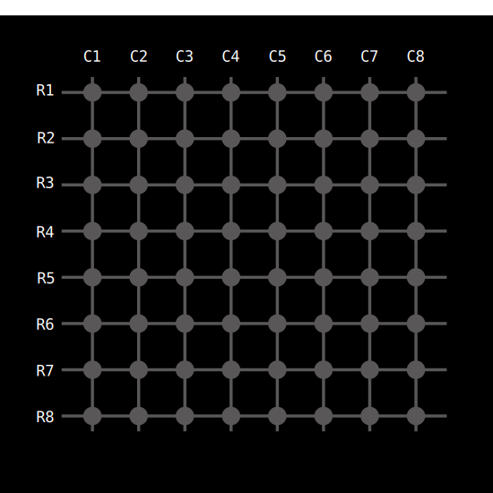

# Why MAX7219?

No, this section is not about why we chose to write a driver for the MAX7219 chip (we did that because it’s simple and fun). This is about why we need this chip in the first place.

## The Problem: Too Many LEDs, Too Few Pins

Imagine you have an 8×8 LED matrix. That's 64 individual LEDs. If you want to control just one LED, it's easy. You connect it to one GPIO pin on the microcontroller and turn it on or off.

But how do you control 64 LEDs with a microcontroller that only has around 20 or 30 GPIOs? You can't give one GPIO for each LED. That would be wasteful. And most microcontrollers don't even have that many pins.

The answer is multiplexing

## Multiplexing

Instead of wiring each LED separately, we arrange the 64 LEDs into a grid: 8 rows and 8 columns. Each LED sits at the intersection of a row and a column.

All the cathodes (negative sides) of LEDs in a row are connected together. All the anodes (positive sides) of LEDs in a column are connected together.

Now the question is, how do we light up an LED? Let's say we want to turn on the LED at second row (we'll call it R2) and second column (we'll call it C2). 

To turn on the LED at R2 and C2:

- We set the row line R2 to low (logic 0) to sink current from the cathode

- We set the column line C2 to high (logic 1) to supply voltage to the anode

This creates a voltage difference across that one LED, and only that LED will turn on. The others will remain off because either their row is not active or their column is not selected.

> ⚡ NOTE: Some LED matrices work the other way around - with anode lines connected to the rows and cathode lines connected to the columns. I chose to explain it this way because the LED matrix (1088AS) we'll use for testing is arranged like this.

## What About Multiple LEDs?

Now suppose we want to light up a diagonal: R1-C1, R2-C2, and R3-C3. If we try to activate all those rows and columns at once, unwanted current paths could cause other LEDs to glow. 

Instead, we turn on one row at a time using time-division multiplexing.  We start by setting row R1 to low (logic 0) to sink current and set the columns so that only column C1 is high (logic 1) to supply voltage. This lights the LED at R1-C1. Then we set row R1 back to high (turn it off), set row R2 to low, and update the columns so that only column C2 is high. Now the LED at R2-C2 lights up. After that, we do the same for row R3 and column C3. One row at a time.

This is the basic idea of multiplexing. We light up one row at a time, very quickly, and update the columns for that row. Then we move to the next row, and so on. If we repeat this fast enough, our eyes cannot notice the flickering, and it looks like all LEDs are on at the same time.  This effect is called persistence of vision.  It might sound a bit crazy if you're hearing it for the first time but it works.

## The Problem with Doing It in Software

If you try to handle this multiplexing yourself in software, you need to switch rows and columns rapidly, maintain precise timing, and still make time for the rest of your program. It quickly becomes complex and inefficient.

On top of that, you need to connect 8 row pins and 8 column pins, which means using 16 GPIOs. That's a lot of wiring and not practical for most microcontrollers.

## The Solution: MAX7219
This is where the MAX7219 comes in.

The MAX7219 is a specialized chip that takes care of all the multiplexing in hardware. You just send the data over SPI, and it does the rest. It automatically cycles through the rows, manages the column states, controls brightness, and refreshes the entire display at high speed. It also stores the current LED states in internal memory, so your microcontroller doesn't have to resend data constantly.

That's why we use the MAX7219. It does the hard part, so we don't have to.

**MAX7219 Datasheet:**

You can find the datasheet [here](https://www.analog.com/media/en/technical-documentation/data-sheets/max7219-max7221.pdf).
