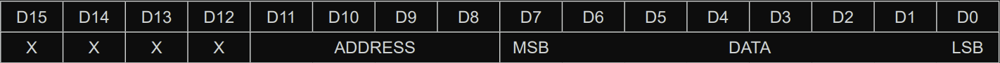

# How Do We Tell the MAX7219 What to Show?

To control what the MAX7219 displays, we need to send instructions using the SPI communication. We use the DIN pin to send data, and we synchronize each bit with the CLK pin.

Inside the MAX7219, there are several registers, and each one can store 8 bits of data. These registers helps to control what appears on the display.

To update the display, we send a 16-bit packet. This packet includes two key parts: the register we want to write to and the data we want to store. We send the most significant bit (D15) first, and the least significant bit (D0) last.

## Structure of the 16-Bit Data Packet



When we send data to the MAX7219, we send a 16-bit packet. This packet is split into three parts:

- Bits D8 to D11 (4 bits): This is the register address. It tells the MAX7219 which internal register we want to write to (like a digit register, intensity register, or shutdown register).

- Bits D0 to D7 (8 bits): This is the data we want to store in that register.

- Bits D12 to D15 (4 bits): These are "don't care" bits. The MAX7219 ignores them, so we usually just set them to 0

Once all 16 bits are shifted in (using CLK), we toggle the LOAD (or CS) pin high to latch the data into the selected register.


## Simplified Register Address Map

The MAX7219 datasheet lists register addresses using a format like 0xXA, 0xXC, etc., where the X represents the upper 4 bits (bits D12-D15) of the 16-bit data packet. These bits are "don't care" because the MAX7219 only uses bits D8-D11 to determine which register to access. The top 4 bits are completely ignored by the chip.

To simplify things, we fill the top nibble with 0 and show only the actual address bits in a standard hexadecimal format. So instead of writing 0xXA, we just use 0x0A. This avoids confusion and clearly shows what you need to send in your SPI packet.

| Address (Hex) | Register Name    | Description                                                       |
| ------------- | ---------------- | ----------------------------------------------------------------- |
| `0x00`        | No-Op            | This register performs no operation and is used when cascading multiple MAX7219 chips.                                                                                                 |
| **Digit Registers** |||
| `0x01`        | Digit 0          | Stores segment data for digit 0                                   |
| `0x02`        | Digit 1          | Stores segment data for digit 1                                   |
| `0x03`        | Digit 2          | Stores segment data for digit 2                                   |
| `0x04`        | Digit 3          | Stores segment data for digit 3                                   |
| `0x05`        | Digit 4          | Stores segment data for digit 4                                   |
| `0x06`        | Digit 5          | Stores segment data for digit 5                                   |
| `0x07`        | Digit 6          | Stores segment data for digit 6                                   |
| `0x08`        | Digit 7          | Stores segment data for digit 7                                   |
| **Control Registers** |||
| `0x09`        | Decode Mode      | Decode Mode: Controls Code B decoding for 7-segment displays, letting the chip automatically map numbers to segments                                                                 |
| `0x0A`        | Intensity        | Sets intensity level for the display (0 to 15)                    |
| `0x0B`        | Scan Limit       | For 7-segment displays, this controls how many digits (1 to 8) are active. For example, if your display has only 4 digits, setting the limit to 3 (DIG0 to DIG3) can make them brighter because the chip is not spending time driving unused digits.                                                                                   |
| `0x0C`        | Shutdown         | Turns the display on or off without clearing any data. This is useful for saving power or flashing the display.                                       |
| `0x0F`        | Display Test     | Lights up all LEDs for testing                                    |

## Command to Turn on Display

To turn on the display, we need to send a 16-bit data packet to the MAX7219. The register address 0x0C selects the Shutdown register, and the value 0x01 tells the chip to exit shutdown mode and enable the display. So the complete packet we send is:

```rust
0x0C01
```
This means: "Write the value 0x01 into the Shutdown register." Once this command is sent, the display will turn on and start showing the data stored in the digit registers.


That is it. Our driver will be around how we send 16-bit packets over SPI. Each packet contains the exact data we want to send to the MAX7219 so we can control the display in the way we choose.
