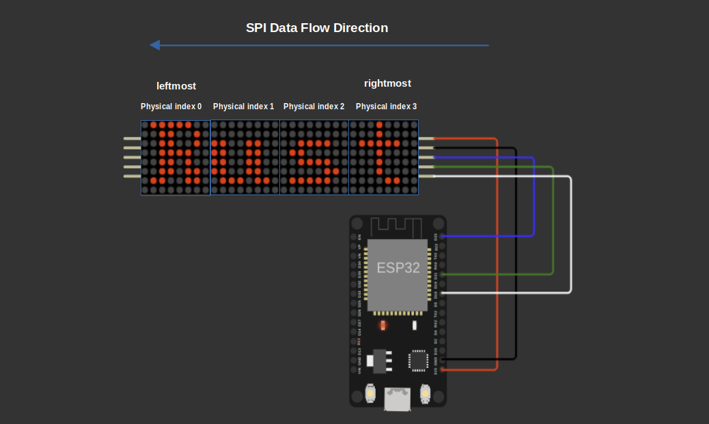

# SPI Communication

We will write two internal helper functions to handle SPI communication with the MAX7219 devices in the chain(or just single device).

## Writing to a Single Device Register in the Chain

The first function, `write_device_register`, sends a single register update to one device in the chain. We start by clearing the entire buffer and then fill only the 2-byte packet (register address and data) for the target device at the correct position in the buffer. Finally, we send the buffer up to the length needed for the connected devices.

If there is just a single device (device index 0, which is the closest to the microcontroller), the offset for the register address is 0 * 2 = 0, and the data byte goes to index 1.

When there are multiple devices, we write at the right offset for the target device, and the rest of the buffer remains zeros (no-ops) to avoid affecting other devices.

<div style="text-align: center;">
  <a href="../images/max7219-daisy-chain-indices.png"></a>
  <figcaption style="font-style: italic; margin-top: 8px; color: #555;">
    Figure 1: 4 daisy-chained Max7219 device Indices
  </figcaption>
</div> 

For example, if there are 4 devices and we want to write to the device at index 2 (the third device from the left), the offset for the register address is 2 * 2 = 4, and the data byte goes at index 5.

So the full data sent through SPI will look like this (2 bytes per device):

| Index | 0 | 1 | 2 | 3 | 4   | 5    | 6 | 7 |
| ----- | - | - | - | - | --- | ---- | - | - |
| Value | 0 | 0 | 0 | 0 | register_addr | data | 0 | 0 |


```rust
pub(crate) fn write_device_register(
    &mut self,
    device_index: usize,
    register: Register,
    data: u8,
) -> Result<()> {
    if device_index >= self.device_count {
        return Err(Error::InvalidDeviceIndex);
    }

    self.buffer = [0; MAX_DISPLAYS * 2];

    let offset = device_index * 2; // 2 bytes(16 bits packet) per display
    self.buffer[offset] = register as u8;
    self.buffer[offset + 1] = data;

    self.spi.write(&self.buffer[0..self.device_count * 2])?;

    Ok(())
}
```

## Writing to All Device Registers at Once

The second function, `write_all_registers`, lets us send register updates to all devices in the daisy chain at once using a single SPI transaction. This makes it efficient for actions like powering on all devices, changing brightness, or other settings that apply to every display.

It takes a slice of (Register, u8) tuples, where each tuple contains the register and data for each device in the chain.

We start by clearing the buffer. Then, we fill it in reverse order because SPI shifts data starting from the last device in the chain to the first. This means the data for the last device goes at the beginning of the buffer, and the data for the first device goes at the end. 

For example, if we have 4 devices and want to send register-data pairs to all, the buffer fills like this:

| Index    | 0              | 1         | 2              | 3         | 4              | 5         | 6              | 7         |
|----------|----------------|-----------|----------------|-----------|----------------|-----------|----------------|-----------|
| Content  | reg_0 | data_0    | reg_1 | data_1    | reg_2 | data_2    | reg_3 | data_3    |

Here, bytes 0 and 1 are for device 0, bytes 2 and 3 for device 1, and so on.

```rust
pub(crate) fn write_all_registers(&mut self, ops: &[(Register, u8)]) -> Result<()> {
    // clear the buffer: 2 bytes per device
    self.buffer = [0; MAX_DISPLAYS * 2];

    // fill in reverse order so that SPI shifts into the last device first
    for (i, &(reg, data)) in ops.iter().enumerate() {
        let offset = i * 2;
        self.buffer[offset] = reg as u8;
        self.buffer[offset + 1] = data;
    }

    // send exactly device_count packets
    let len = self.device_count * 2;
    self.spi.write(&self.buffer[..len])?;

    Ok(())
}
```

If you are curious and want to understand it better, you can remove the pub(crate) marker from these functions to make them accessible outside the crate. Then, create an instance of the Max7219 struct and call these functions with raw register values. For example, try sending `0x01` to the Shutdown register and watch how the display reacts. (At least that's what I did when I was building the driver and testing the initial setup.)


## Tests

We add tests to verify the SPI communication functions. One test checks that writing to a device index outside the allowed range returns an error. Another test confirms that writing to a valid device index sends the correct SPI data for that device while sending no-ops to others. The third test verifies that write_all_registers sends the correct data for all devices in the chain in one SPI transaction.

As you might already know (we explained this in the DHT22 driver chapter), when using the embedded-hal mock, we need to set expectations; in this case, for the SPI mock. Each SPI transaction must be marked clearly using the transaction_start and transaction_end functions.

If you look at the `test_write_all_registers_valid` function, you'll see that all the SPI data is wrapped inside a single transaction. This is because the `write_all_registers` function uses just one SPI transaction to send commands to all devices at once.

```rust
#[cfg(test)]
mod tests { // The same block as we created before
    // Update the imports:
    use super::*;
    use crate::MAX_DISPLAYS;
    use embedded_hal_mock::eh1::{spi::Mock as SpiMock, spi::Transaction}; // just imported Transaction

    #[test]
    fn test_write_device_register_valid_index() {
        let expected_transactions = [
            Transaction::transaction_start(),
            Transaction::write_vec(vec![
                Register::Shutdown.addr(),
                0x01,
                0x00, // no-op for second device in chain
                0x00,
            ]),
            Transaction::transaction_end(),
        ];
        let mut spi = SpiMock::new(&expected_transactions);
        let mut driver = Max7219::new(&mut spi)
            .with_device_count(2)
            .expect("Should accept valid count");

        driver
            .write_device_register(0, Register::Shutdown, 0x01)
            .expect("should write register");

        spi.done();
    }

    #[test]
    fn test_write_device_register_invalid_index() {
        let mut spi = SpiMock::new(&[]); // No SPI transactions expected
        let mut driver = Max7219::new(&mut spi)
            .with_device_count(2)
            .expect("Should accept valid count");

        let result = driver.write_device_register(2, Register::Shutdown, 0x01); // Index 2 is invalid for device_count=2
        assert_eq!(result, Err(Error::InvalidDeviceIndex));

        spi.done();
    }

    #[test]
    fn test_write_all_registers_valid() {
        let expected_transactions = [
            Transaction::transaction_start(),
            Transaction::write_vec(vec![
                Register::Intensity.addr(),
                0x01,
                Register::Intensity.addr(),
                0x01,
            ]),
            Transaction::transaction_end(),
        ];
        let mut spi = SpiMock::new(&expected_transactions);
        let mut driver = Max7219::new(&mut spi)
            .with_device_count(2)
            .expect("Should accept valid count");

        driver
            .write_all_registers(&[(Register::Intensity, 0x01), (Register::Intensity, 0x01)])
            .expect("should  write all registers");

        spi.done();
    }
}
