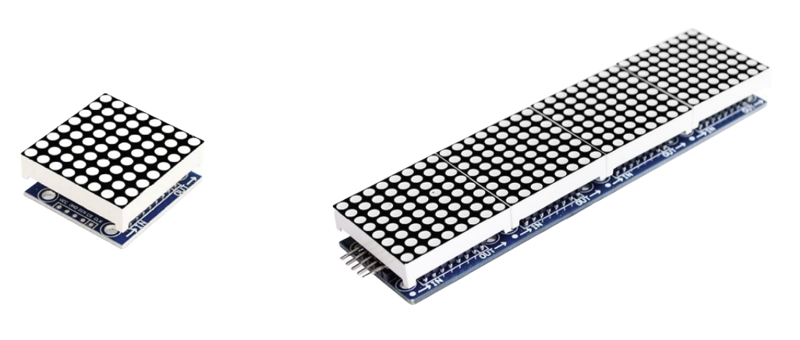
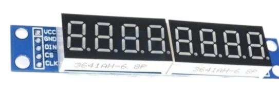

# Writing a Rust Driver for the MAX7219 LED Display

In this chapter, we will write an embedded driver for the MAX7219 chip. This is a popular integrated circuit that can control dot matrix displays, 7-segment displays, and bar graphs. The MAX7219 is commonly used in hobby projects like digital clocks, scrolling message boards, counters, temperature displays, simple games, and more.

It also supports daisy-chaining, which means you can connect several displays in a row to create larger and more advanced visual projects, such as signs and message boards.

You can use the MAX7219 to display numbers, letters, or simple animations. It helps you create everything from basic clocks to scrolling text boards with less effort.

## Dot Matrix Display

A dot matrix display is made up of many tiny LEDs arranged in a grid, usually 8 rows by 8 columns per module. By turning on different LEDs, you can create letters, numbers, symbols, or simple graphics. 

When you connect several 8x8 modules in a row, like an 8x32 display, you get a larger screen that can show longer messages or more detailed images.

The MAX7219 controls all the LEDs in the matrix, handling the complex timing and scanning so you only need to send the data you want to show.

## Eight Digit 7-Segment Display

A 7-segment display is made of seven LED segments arranged to form numbers and some letters. The eight-digit version lets you show up to eight characters, making it perfect for clocks, counters, or any project that needs clear numeric output.

