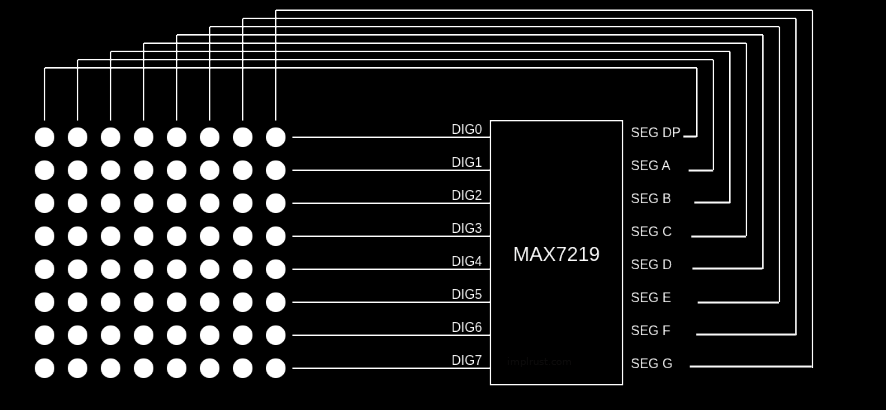
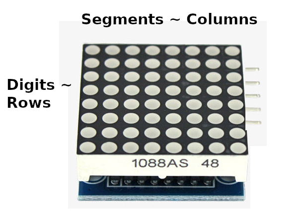

# LED Matrix

Now, let's look at the 8x8 LED matrix and how it is arranged and connected to the MAX7219. An 8x8 LED matrix consists of 64 LEDs arranged in rows and columns (8 rows and 8 columns).

The 7-segment display we saw earlier was pretty straightforward and standardized. There is no fixed or universal mapping between the MAX7219's outputs and the rows and columns of the matrix.
 
## Modules

There are different types of LED matrix modules available, and each type may wire the rows and columns differently. This means the display orientation and behavior can vary between modules. Some modules wire them left-to-right, others right-to-left, or even top-to-bottom or bottom-to-top. The two most common types are Generic and FC-16. The FC-16 type is especially popular in daisy-chained matrix displays. I also bought a single matrix FC-16 module for testing. 

In this section, I will explain things from the perspective of the FC-16 module. It uses a MAX7219 driver along with a 1088AS LED matrix. According to the 1088AS datasheet, the columns are anodes and the rows are cathodes. This means the MAX7219's segments (which source current) are connected to the columns, while the digits (which sink current) are connected to the rows.

If you are using a single matrix, identifying which side is row and which is column can be confusing, because single led matrix is a square. To identify it correctly, position the matrix so that the text "1088AS" is at the bottom and touches the table. When you do that, the input pins for the module will be on the right side(from your point of view).

## References

- [Assembling FC-16 module](https://makerselectronics.com/product/max7219-8x8-dot-led-matrix-fc-16/): This is the article that i used while soldering and fitting 1088AS LED matrix on the module. 
- [1088AS Datasheet](https://cdn.velleman.eu/downloads/29/infosheets/vmp502_led8x8_1088as.pdf)
