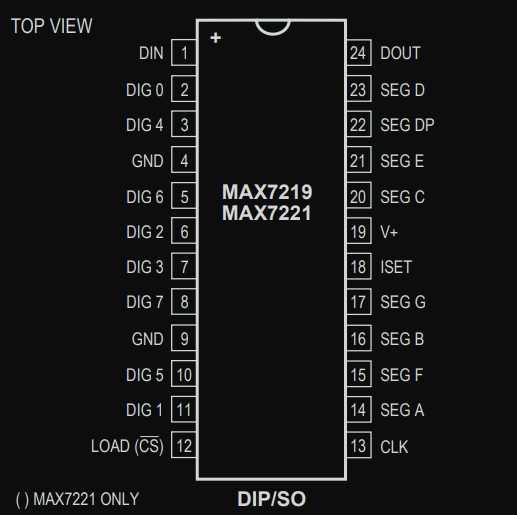

# Pin Configuration

The MAX7219 has a total of 24 pins. Out of these, 8 are digit pins (labeled DIG0 to DIG7) and 8 are segment pins (labeled SEG A to SEG G and DP). The remaining pins are used for power and communication.

> Note: If you read the datasheet, you will also see another chip called MAX7221 mentioned. It is nearly identical to the MAX7219, the main difference is that the MAX7221 supports standard SPI™, QSPI™, and MICROWIRE™ interfaces.

## Communication Pins

These four pins are used for serial communication between the microcontroller and the MAX7219:

- **DIN (Data In)**: We use this pin to send display data to the MAX7219. Whatever we want to show on the LEDs is sent here from the microcontroller.

- **CLK (Clock)**: This pin provides the clock signal that controls the timing of data transfer.

- **LOAD (Chip Select)**: Also labeled CS on the MAX7221, this pin tells the chip when to take in the received data and update the display.

- **DOUT (Data Out)**: If we connect more than one MAX7219 in a chain (called a daisy-chain), this pin passes the data to the next chip. It should be connected to the **DIN** pin of the next MAX7219 module.
