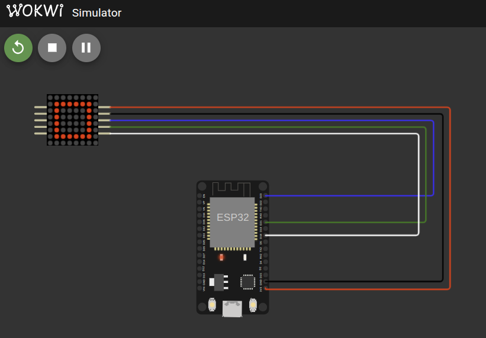

# Using with ESP32

Now that we have successfully built the driver for the MAX7219 chip and verified it with mock tests, it's time to try it on real hardware. I purchased the Single LED Matrix (FC-16 module with 1088AS) powered by the MAX7219. You can also get daisy-chained LED matrices, but make sure it is the FC-16 type to simplify testing since our driver is designed and tested with that module in mind.

## Circuit

Here's a simple circuit connection for wiring the FC-16 MAX7219 LED matrix module to an ESP32.

| FC-16 (MAX7219 Module) Pin | ESP32 Pin     | Notes                |
| -------------------------- | ------------- | -------------------- |
| VCC                        | 3.3V or 5V    | Power supply         |
| GND                        | GND           | Ground               |
| DIN (Data In)              | GPIO23 (MOSI) | SPI Master Out       |
| CLK (Clock)                | GPIO18 (SCK)  | SPI Clock            |
| CS  (Chip Select)          | GPIO21        | SPI Chip Select (CS) |

> ⚠️  Important: If you are using daisy-chained LED matrices, do not power the LED matrix from the microcontroller's 3.3V or 5V pin directly.
>
> Use a separate external 5V power supply to power the LED matrices.
>
> Failing to do so can damage your microcontroller or the LED matrices due to high current draw.
> Always connect the grounds of both power supplies together to have a common reference.


## Add the Crate as a Dependency

Create new project with esp-generate tool and add your Git repository as a dependency in your Cargo.toml:

```toml
embedded-hal-bus = "0.3.0"

# Full Crate
# max7219-display = { git = "https://github.com/ImplFerris/max7219-display", features = [] }

# Bare driver for the Red book:
max7219-driver-project = { git = "https://github.com/ImplFerris/max7219-driver-project" }
```

## Full code

This example initializes the driver and uses the write_raw_digit function to draw an hollowed square on the LED matrix.

```sh
        0 1 2 3 4 5 6 7  (columns)
    +-----------------
    0 | . . . . . . . .
    1 | . O O O O O O .
    2 | . O . . . . O .
    3 | . O . . . . O .
    4 | . O . . . . O .
    5 | . O . . . . O .
    6 | . O O O O O O .
    7 | . . . . . . . .
(rows)
```

```rust
#![no_std]
#![no_main]
#![deny(
    clippy::mem_forget,
    reason = "mem::forget is generally not safe to do with esp_hal types, especially those \
    holding buffers for the duration of a data transfer."
)]

use defmt::info;
use esp_hal::clock::CpuClock;
use esp_hal::main;
use esp_hal::time::{Duration, Instant};
use esp_println as _;

use embedded_hal_bus::spi::ExclusiveDevice;
use esp_hal::gpio::{Level, Output, OutputConfig};
use esp_hal::spi::master::Config as SpiConfig;
use esp_hal::spi::master::Spi;
use esp_hal::spi::Mode as SpiMode;
use esp_hal::time::Rate;
use max7219_driver_project::driver::Max7219;

#[panic_handler]
fn panic(_: &core::panic::PanicInfo) -> ! {
    loop {}
}

esp_bootloader_esp_idf::esp_app_desc!();

#[main]
fn main() -> ! {
    // generator version: 0.4.0

    let config = esp_hal::Config::default().with_cpu_clock(CpuClock::max());
    let peripherals = esp_hal::init(config);

    let spi = Spi::new(
        peripherals.SPI2,
        SpiConfig::default()
            .with_frequency(Rate::from_mhz(10))
            .with_mode(SpiMode::_0),
    )
    .unwrap()
    //CLK
    .with_sck(peripherals.GPIO18)
    //DIN
    .with_mosi(peripherals.GPIO23);
    let cs = Output::new(peripherals.GPIO21, Level::High, OutputConfig::default());

    let spi_dev = ExclusiveDevice::new_no_delay(spi, cs).unwrap();

    let mut driver = Max7219::new(spi_dev);
    driver.init().unwrap();

    let device_index = 0;

    // Inner hollow square:
    let inner_hollow_square: [u8; 8] = [
        0b00000000, // row 0 - all LEDs off
        0b01111110, // row 1 - columns 1 to 6 ON (bits 6 to 1 = 1)
        0b01000010, // row 2 - columns 6 and 1 ON (edges)
        0b01000010, // row 3 - columns 6 and 1 ON
        0b01000010, // row 4 - columns 6 and 1 ON
        0b01000010, // row 5 - columns 6 and 1 ON
        0b01111110, // row 6 - columns 1 to 6 ON (bits 6 to 1 = 1)
        0b00000000, // row 7 - all LEDs off
    ];

    for digit in 0..8 {
        driver
            .write_raw_digit(device_index, digit, inner_hollow_square[digit as usize])
            .unwrap();
    }

    loop {
        info!("Hello world!");
        let delay_start = Instant::now();
        while delay_start.elapsed() < Duration::from_millis(500) {}
    }
}
```

## Clone Existing Project

If you want to get started quickly, you can clone a ready-to-use example project from my repository:

```sh
git clone https://github.com/implferris/max7219-esp32-demo
cd max7219-esp32-demo
```

This project includes Wokwi configuration, so you can test it with the MAX7219 LED matrix virtually, right inside VSCode using the Wokwi simulator. No physical hardware needed to get started. Just install the Wokwi extension for VSCode and run the project to see the LED matrix in action. For details, visit [https://docs.wokwi.com/vscode/getting-started](https://docs.wokwi.com/vscode/getting-started).




