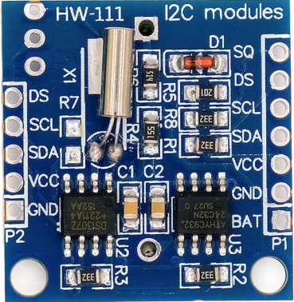

# DS1307

The DS1307 keeps track of seconds, minutes, hours, day of the week, date of the month, month, and year with leap-year compensation valid up to the year 2100. The device automatically adjusts the end-of-month date for months with fewer than 31 days, including leap-year corrections.

According to the [datasheet](https://www.analog.com/media/en/technical-documentation/data-sheets/ds1307.pdf), it includes 56 bytes nonvolatile RAM for data storage.  It consumes less than 500 nA in battery backup mode with the oscillator running.

The DS1307 supports both 24-hour and 12-hour time formats with an AM/PM indicator.  A built-in power-sense circuit capable of detecting power failures and automatically switches to a backup battery, allowing timekeeping to continue without interruption.  

## Module

The DS1307 is available in two package types: an 8-pin DIP, which is larger and breadboard-friendly, and an 8-pin SOIC, which is smaller and intended for soldering onto circuit boards. You can buy just the chip or a complete RTC module that includes the DS1307, an external memory chip such as the AT24C32, and a battery holder so it can keep time even when power is removed.

I purchased an HW-111 RTC module, which is one of the common options. Another popular choice is the Tiny RTC module. These modules include the DS1307 IC, an [AT24C32 EEPROM](https://ww1.microchip.com/downloads/en/devicedoc/doc0336.pdf) for extra storage, and a 32.768 kHz crystal for accurate timekeeping.

# DS1307 Module Pinout

  
  <figcaption style="font-style: italic; margin-top: 8px; color: #555;">
    Figure 1: DS1307 Module Pinout
  </figcaption>

 

The DS1307 module has two identical rows of pins labeled **P1** (right side) and **P2** (left side). Pins with the same name are internally connected, so we can use either side. This is especially useful when daisy-chaining modules.

- **SQ** - Square Wave output pin. It can be configured to generate a steady square wave at selectable frequencies of 1 Hz, 4 kHz, 8 kHz, or 32 kHz. This is useful in projects that require a consistent timed pulse.
- **DS** - Optional temperature sensor output. If the module includes a DS18B20 temperature sensor mounted near the battery holder (labeled U1), this pin will output temperature data.
- **SCL** - Serial Clock line for the I2C interface. It synchronizes data transfer between the DS1307 and the microcontroller.
- **SDA** - Serial Data line for the I2C interface. It is used for bidirectional data transfer.
- **VCC** - Power supply input for the module. The operating voltage is typically 3.3 V to 5.5 V.
- **GND** - Ground connection. 
 - **BAT** - a backup supply input for a standard 3V lithium cell or other energy source, ensuring accurate timekeeping when the main power is interrupted.

## I2C Interface

We can use the I2C protocol to communicate between the module and a microcontroller. Both the DS1307 RTC chip and the onboard 24C32 EEPROM share the same I2C bus. Each device has its own fixed address so the microcontroller can tell them apart. The DS1307 uses address `0x68`, while the 24C32 uses address `0x50`.

The DS1307 only works with standard I2C speed, which is 100kHz.
