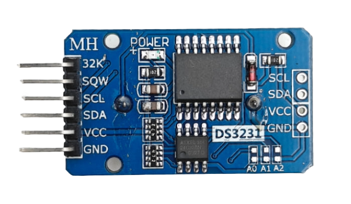

# DS3231

In this chapter, we will implement the RTC HAL and create a driver for the DS3231 chip. Most of the concepts and code will be similar to the DS1307 driver.

The DS3231 is slightly more expensive and maintains accuracy far better than the DS1307. While a DS1307 might drift (lose or gain time) by several minutes per month, the DS3231 maintains accuracy within seconds per year. This precision comes from its built-in temperature-compensated crystal oscillator that continuously monitors the chip's operating temperature and adjusts the crystal frequency accordingly.

The DS3231 is very accurate in normal room temperatures. Between 0°C and 40°C, it only drifts about 1 minute per year. Even in extreme temperatures from -40°C to 85°C, it still stays within about 2 minutes per year.

## Additional Features

The DS3231 also has extra features that the DS1307 doesn't have. It can set two different alarms that can wake up your microcontroller at specific times. For example, you could set one alarm to turn on an LED every morning at 8 AM and another to take a sensor reading every hour. It even has a register that lets you fine-tune the accuracy if needed.

You can find the datasheet for the DS3231 [here](https://www.analog.com/media/en/technical-documentation/data-sheets/DS3231.pdf).

> I originally planned to include the alarm feature in this chapter, but as I wrote, the chapter became too long. So i'll skip this part to keep the tutorial simple.

## DS3231 Pinout

The DS3231 module pinout is very similar to the DS1307. It also has similar pin arrangements.

  
  <figcaption style="font-style: italic; margin-top: 8px; color: #555;">
    Figure 1: DS3231 Module Pinout
  </figcaption>

**It has the same four main pins:**

- VCC - Power supply (3.3V or 5V)
- GND - Ground connection
- SDA - I2C data line
- SCL - I2C clock line

You connect these pins exactly the same way as the DS1307. VCC goes to power, GND goes to ground, and SDA and SCL connect to your microcontroller's I2C pins.

**Additonal pins:**

The 32K pin provides a stable 32.768kHz square wave signal. This can be used as a clock reference for other devices if needed.

The SQW is the Square Wave output pin. It can be configured to act as an interrupt signal triggered by the RTC alarms, or to output a square wave at frequencies like 1 Hz, 4 kHz, 8 kHz, or 32 kHz.
