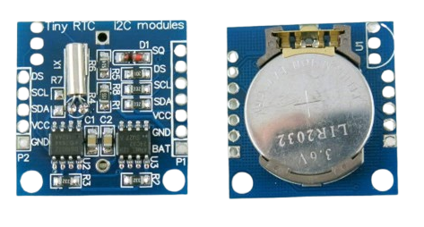
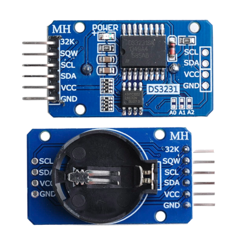

# Real Time Clock [Draft]

Have you ever wondered how your computer, phone, or even your microwave keeps track of time even when it's unplugged? That's where Real Time Clock (RTC) modules come in. It is a kind of watch but tiny in size which will be used with microcontrollers and computers.

  
  <figcaption style="font-style: italic; margin-top: 8px; color: #555;">
    Figure 1: DS1307
  </figcaption>

 

The DS1307 is one of the most popular and cheap RTC modules you can buy. It does basic timekeeping and works well for most projects where you don't need perfect accuracy.

  
  <figcaption style="font-style: italic; margin-top: 8px; color: #555;">
    Figure 2: DS3231
  </figcaption>

 

The DS3231 costs a bit more than the DS1307 but it's much more accurate. RTC like the DS1307 can lose or gain time because temperature changes mess with their timing. When it gets hot or cold, the clock runs fast or slow. The DS3231 fixes this problem by watching the temperature and adjusting itself automatically. It also has extra features like alarms that can wake up your microcontroller at set times.

## What Makes RTCs Special?

One of the best things about an RTC is that it can keep running even if your main power is turned off. This is possible because it has a small backup power source. Some modules usually use a coin-cell lithium battery for this, while others may use a tiny rechargeable part called a supercapacitor. It is just like a wristwatch that runs on a battery. Since RTCs use very little power, that backup can keep them running for months or even years without needing a recharge or replacement.

## I2C Communication

Both modules use I2C communication. It's one of the reasons I chose them because I want to write one chapter that uses I2C. Once we write the driver for the DS1307, the DS3231 will be much simpler since most of the communication is the same.

## What We'll Build

At first, I planned to write separate drivers for the DS1307 and DS3231. But then I found the "rtcc" crate, which uses a smart approach with traits. This gave me a better idea.

Instead of just making two separate drivers, we'll build something more interesting. We'll create our own RTC HAL that can work with any RTC module. Here's what we'll do:

1. Create a RTC HAL crate that defines generic RTC traits; This will define what any RTC should be able to do
2. Build drivers for DS1307 and DS3231 that both implement the RTC HAL traits
3. Finally i will show you a demo app that works with either module using the same code

The cool part is that our test program won't care which RTC chip you use. This means the same code will work whether you connect a DS1307, DS3231, or any other RTC chip(that implements our RTC HAL trait). You can change the RTC and everything still works.

## Finished Project

Here's the final project for reference.

This demo app(end-user example) uses different RTC drivers (DS1307 and DS3231) with RTC HAL traits:
[http://github.com/implferris/rtc-hal-demo](http://github.com/implferris/rtc-hal-demo)

These driver crates implements RTC HAL traits:
- DS1307 RTC Driver: [https://github.com/implferris/ds1307-rtc](https://github.com/implferris/ds1307-rtc)
- DS3231 RTC Driver: [https://github.com/implferris/ds3231-rtc](https://github.com/implferris/ds3231-rtc)

The rtc-hal trait (the foundation, like embedded-hal crate):
[https://github.com/implferris/rtc-hal](https://github.com/implferris/rtc-hal)

I listed this project backwards - starting from the end user view, then working back to rtc-hal. This shows you the big picture of how it all works together. But in the chapter, we'll start from rtc-hal because that's the foundation, and then moving upward.
 