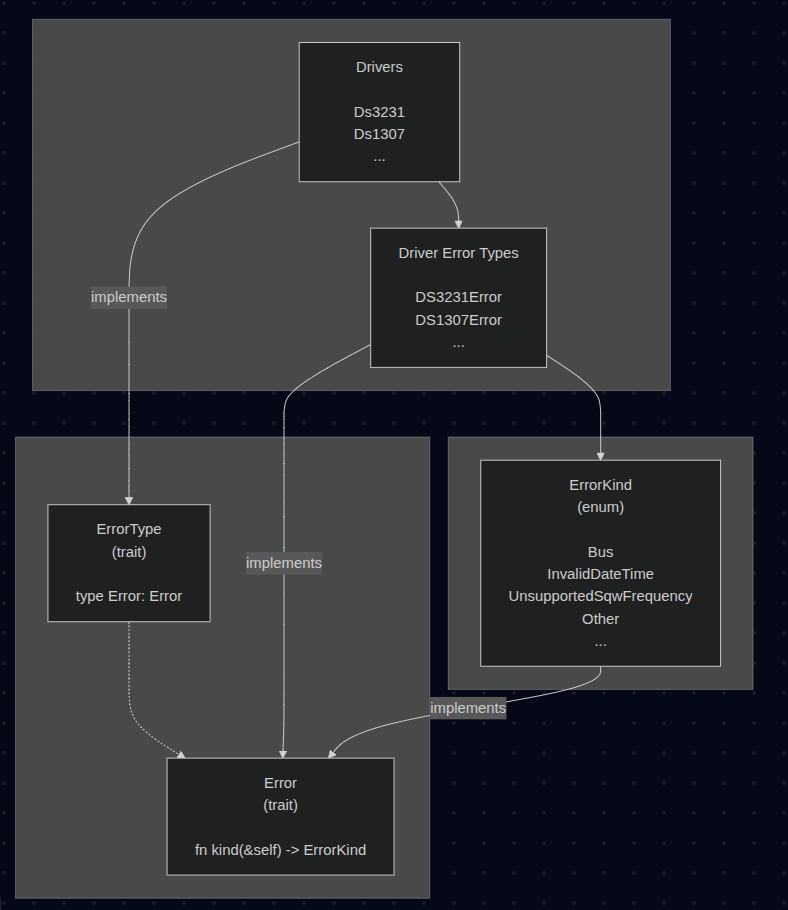

# Error Types

Before we can define methods for our RTC traits, we need to figure out how to handle errors. We'll use the same approach as embedded-hal.

## Evolution of Error Handling in embedded-hal

Before version 1.0, embedded-hal used an associated Error type in each trait. This was simple but caused problems; drivers couldn't easily work with errors in a generic way since each HAL had its own error enum.

In version 1.0, embedded-hal introduced a new model. HALs can still define their own error enums, but those error types must implement a common Error trait that exposes a standardized ErrorKind. This allows applications and generic drivers to inspect errors in a portable way, independent of the underlying implementation.

### Example Problematic Code
Looking at this example code, you can see the problem with just using associated types. Driver1 and Driver2 each define their own error enums.

In application code that works with any RTC driver, you can only print the error or check if one occurred. But you can't inspect what specific error happened.

If you want to take different actions based on the error type - like retrying on InvalidAddress or logging InvalidDateTime; this approach won't work. The error is just T::Error and you have no way to match on the actual error variants across different drivers.

```rust
pub trait Error: core::fmt::Debug {}

pub trait Rtc {
    type Error: Error;

    fn get(&self) -> Result<(), Self::Error>;
}

mod driver1 {
    pub struct Driver1 {}

    #[derive(Debug, Eq, PartialEq, Copy, Clone)]
    pub enum Error {
        InvalidAddress,
        InvalidDateTime,
    }

    impl super::Error for Error {}

    impl super::Rtc for Driver1 {
        type Error = Error;
        fn get(&self) -> Result<(), Self::Error> {
            Ok(())
        }
    }
}

mod driver2 {
    pub struct Driver2 {}

    #[derive(Debug, Eq, PartialEq, Copy, Clone)]
    pub enum Error {
        InvalidAddress,
        InvalidDateTime,
    }

    impl super::Error for Error {}

    impl super::Rtc for Driver2 {
        type Error = Error;
        fn get(&self) -> Result<(), Self::Error> {
            Ok(())
        }
    }
}

// User Application code that uses any driver
fn fun<T: Rtc>(r: T) {
    match r.get() {
        Err(e) => {
            // Problem: we can't inspect what kind of error this is!
            // `e` is just `T::Error` - could be driver1::Error or driver2::Error
            // No way to match on specific error types like InvalidAddress, InvalidDateTime, etc.
            // Each driver has different error enums with no common interface
            println!("Error: {:?}", e);
        }
        _ => {}
    }
}

pub fn main() {
    let d1 = driver1::Driver1 {};
    let d2 = driver2::Driver2 {};

    fun(d1);
    fun(d2);
}
```

## Our RTC Error Design

We'll use the same pattern as embedded-hal 1.0 and Rust's std::io::Error. Define standard error kinds so RTC drivers like ds3231 and ds1307 can use errors that fit their hardware while applications can handle errors the same way across different drivers.

Here is the overall Architecture of the RTC HAL error handling:

<div style="text-align: center;">
  <a href="./images/rtc-hal-error.png"></a>
  <figcaption style="font-style: italic; margin-top: 8px; color: #555;">
    Figure 1: RTC HAL Error Handling Architecture
  </figcaption>
</div> 
